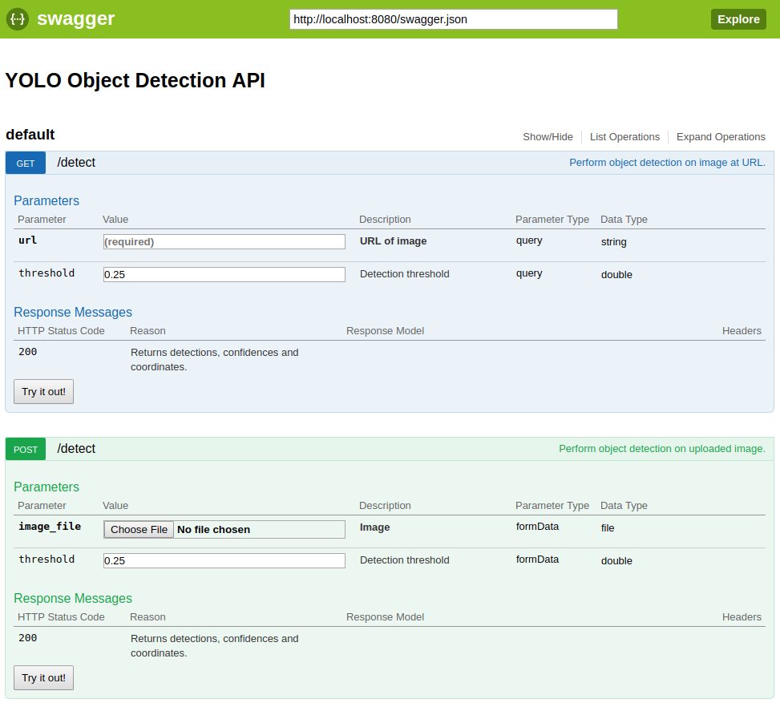
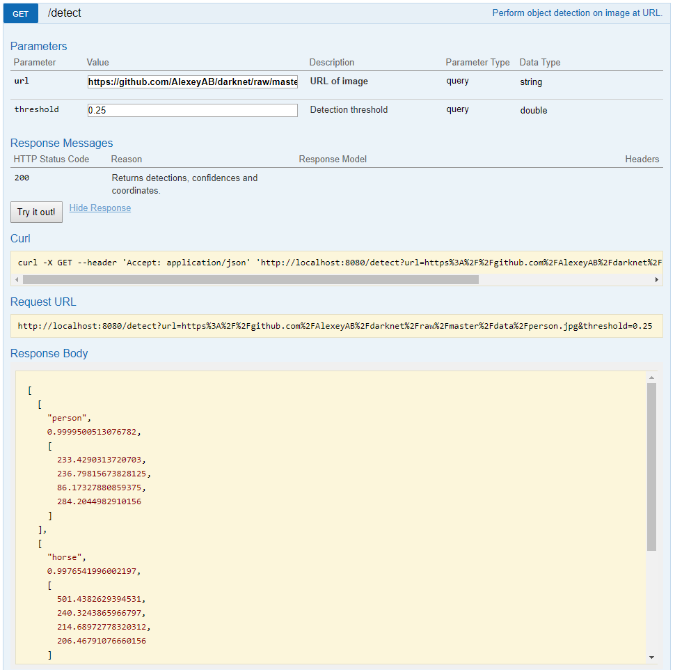

# Building an object detection service using YOLO and Docker

_Note: This is an archived blog post from 2019-09-05_

These days object detection models are readily available as online services from the large cloud providers. However, when
experimenting at home I prefer not having to rely on online services but instead have local services I can spin up on demand. After a bit of googling I didn't find anything that exactly matched my needs, so I thought why not just build something myself.

In the following I'll go through some of the details of the build. All the code is available on [GitHub](https://github.com/johannestang/yolo_service) and the Docker images on [Docker Hub](https://hub.docker.com/r/johannestang/yolo_service).

## Choosing a model

The model I'll be using is [YOLOv3](https://pjreddie.com/darknet/yolo/). There are a number of reasons for this:

1. At the moment, it is one of the best performing object detection models in terms of both precision and speed.
2. It's a model I'm familiar with.
3. The authors have provided an implementation of the model making it easy to work with.
4. The authors have provided pre-trained versions of the model.

I won't go into any details about the YOLO model here, there are plenty of great blog posts out there that do that (for an overview of YOLOv3 have a look [here](https://towardsdatascience.com/yolo-v3-object-detection-53fb7d3bfe6b)). Instead, I'll focus on building a dockerized service around a pre-trained version of the model.

Note, that in the following I will not be using the authors [original repository](https://github.com/pjreddie/darknet) for the implementation, but instead a forked version by [AlexeyAB](https://github.com/AlexeyAB/darknet) which contains a number of [improvements](https://github.com/AlexeyAB/darknet#improvements-in-this-repository). For me, the most notable improvement is the support for [Tensor Cores](https://developer.nvidia.com/tensor-cores).

## Talking to the model

Before we can actually put the service together we need to figure out what pieces we need. First, we need a way to interface with the model. Fortunately, the implementation of the model comes with Python bindings, so it's fairly easy.

A trained YOLO model is comprised of four files:

1. The model configuration including model architecture - called `configPath` below.
2. The trained weights of the model - called `weightPath` below.
3. The data configuration - called `metaPath` below.
4. A list of the classes the model was trained on - referenced in the data configuration.

If we, as an example, use a model trained on the [COCO dataset](http://cocodataset.org/) we can run a detection:

```{python}
import darknet

configPath = "data/yolov3.cfg"
weightPath = "yolov3.weights"
metaPath = "data/coco.data"

filename = "person.jpg"
threshold = 0.25

net = darknet.load_net(bytes(configPath, "ascii"), bytes(weightPath, "ascii"), 0)
meta = darknet.load_meta(bytes(metaPath, "ascii"))
detection = darknet.detect(net, meta, bytes(filename, "ascii"), threshold)

print(detection)
```

If you have a look at the [coco.data](https://github.com/AlexeyAB/darknet/blob/master/cfg/coco.data) file, you can find the file with the list of classes the model can detect, [coco.names](https://github.com/AlexeyAB/darknet/blob/master/data/coco.names).

Note, that there is a small annoyance when using the Python bindings. The inputs need to be byte strings and the outputs will also be byte strings, so a bit of conversion is needed.

If we use an [example image](https://github.com/AlexeyAB/darknet/blob/master/data/person.jpg) from the repository, we get the following output (after all the initialization output of the model):

```{shell}
[(b'person', 0.9999500513076782, (233.4290313720703, 236.79815673828125, 86.17327880859375, 284.2044982910156)), (b'horse', 0.9976541996002197, (501.4382629394531, 240.3243865966797, 214.68972778320312, 206.46791076660156)), (b'dog', 0.9944573640823364, (132.1176300048828, 306.22393798828125, 147.24972534179688, 88.9013671875))]
```
A list of detections where each detection is a tuple with class label, detection confidence, and coordinates of detection.

## Building an API

In order to build the API as quickly as possible I use [connexion](https://github.com/zalando/connexion) which allows you to expose your Python code as a REST API without adding much code. The first step is to define the endpoints:

```{yaml}
swagger: '2.0'
info:
  title: YOLO Object Detection API
  version: '1.0'
consumes:
  - application/json
produces:
  - application/json
paths:
  /detect:
    get:
      operationId: app.detect_from_url
      summary: Perform object detection on image at URL.
      parameters:
        - name: url
          in: query
          description: URL of image
          type: string
          required: true
        - name: threshold
          in: query
          description: Detection threshold
          type: number
          minimum: 0
          maximum: 1
          default: 0.25
      responses:
        200:
          description: Returns detections, confidences and coordinates.
    post:
      operationId: app.detect_from_file
      summary: Perform object detection on uploaded image.
      consumes:
        - multipart/form-data
      parameters:
        - name: image_file
          in: formData
          description: Image
          type: file
          required: true
        - name: threshold
          in: formData
          description: Detection threshold
          type: number
          minimum: 0
          maximum: 1
          default: 0.25
      responses:
        200:
          description: Returns detections, confidences and coordinates.
```

Most of it should be fairly self-explanatory. But, essentially, there will be just one endpoint `detect` where a GET request allows us to pass a URL to a file we want to perform detection on, and a POST request allows us to upload a file for detection. In addition to either the URL or actual file, we allow the user to specify the detection threshold. We can do simple input validation, so in this case we enforce that the threshold must be between 0 and 1. Besides this, the important part is the `operationId` argument which specifies the Python function that will be called.

Once the functions referenced in the `operationId` fields above have been implemented and the API definition has been saved as `swagger.yaml`, it takes very little code to create the API:

```{python}
import connexion

def detect_from_url(url, threshold): # Code omitted
def detect_from_file(): # Code omitted

app = connexion.App(__name__)
app.add_api('swagger.yaml')

if __name__ == '__main__':
    app.run(port=8080, server='gevent')
```

If we take a look at the first detection function

```{python}
def detect_from_url(url, threshold):
    try:
        # Use mkstemp to generate unique temporary filename
        fd, image_file = tempfile.mkstemp(".jpg")
        os.close(fd)
        urllib.request.urlretrieve(url, image_file)
    except:
        return 'Error getting/reading file', 500
    try:
        res = detect(image_file, threshold)
        os.unlink(image_file)
    except:
        return 'Error in detection', 500
    return res
```
we see that it is quite straightforward. It first downloads the image at the URL and saves it to a temporary file. In order to get a unique filename I use `mkstemp`. It's not that elegant, but it's a simple way of generating a unique name. If something goes wrong in the download we send the caller an HTTP 500 error. Next on to the detection. Again if something goes wrong the caller gets an HTTP 500 error. Finally, we return the detection.

If you have a look in my repository you can view the [full code](https://github.com/johannestang/yolo_service/blob/master/app.py). Note two things:

1. As we saw above the returned class labels are byte strings, these are being converted otherwise we will get serialization errors when returning it to the caller.
2. I've added a signal handler to catch SIGTERM. It's not critical, but it ensures a cleaner/quicker shutdown when the Docker container is stopped. When stopping a container Docker first sends SIGTERM and waits for the application to stop. If it doesn't stop it kills it.

## Building the Docker image

We cannot use the Python bindings in the examples above without the `darknet` shared library. That's in itself not a problem, we'll just build it in the Docker container. But this will give us an unnecessarily large Docker image as we need to have a full development stack. In order to get as small an image as possible we will use [multi-stage builds](https://docs.docker.com/develop/develop-images/multistage-build/).

We first define a build image:

```{Dockerfile}
# Build image
FROM ubuntu:18.04 AS build
RUN apt-get update
RUN apt-get install -y build-essential git

# Get and compile darknet
WORKDIR /src
RUN git clone -n https://github.com/AlexeyAB/darknet.git
WORKDIR /src/darknet
RUN git checkout 4c315ea26b56c2bf20ebc240d94386c6e3cc83db
RUN sed -i -e "s!OPENMP=0!OPENMP=1!g" Makefile && \
    sed -i -e "s!AVX=0!AVX=1!g" Makefile && \
    sed -i -e "s!LIBSO=0!LIBSO=1!g" Makefile && \
    make
```
Our starting point is a plain Ubuntu image where we install `build-essentials`. We clone AlexeyAB's repository, set a few options in the `Makefile` and run `make`. The critical part here is that we have named the image `build`. This allows us to reference it later.

Continuing (in the same `Dockerfile`) we can now define what will be our final image:
```{Dockerfile}
# App image:
FROM ubuntu:18.04

# Bare-bones python install
RUN apt-get update && \
    apt-get install -y libgomp1 wget && \
    apt-get install -y --no-install-recommends python3-pip && \
    apt-get install -y python3-setuptools && \
    pip3 install --no-cache-dir wheel && \
    rm -rf /var/lib/apt/lists

# Get darknet from build image
WORKDIR /app
COPY --from=build /src/darknet/libdarknet.so .
COPY --from=build /src/darknet/build/darknet/x64/darknet.py .
COPY --from=build /src/darknet/cfg data/
COPY --from=build /src/darknet/data data/
```
An obvious question: Why go through the trouble of installing Python on an Ubuntu image when you can just use a [Python image](https://hub.docker.com/_/python)? If we take, for instance, the `python:3.6-slim` image, it is 174MB. The image above, which is sufficient for what we need, is only 103MB (without `libgomp1`, `wget` and `darknet`).

After having set up the Python environment we then copy the `darknet` shared library and Python bindings from the build image as well as the configurations for the pre-trained models.

But what about this `libgomp1`, why is it needed? When I build Docker images it is typically a lot of trial and error. So let's try and build the image as defined until now but without `libgomp1`:

```{shell}
$ docker build -t testimage .
```
We can then create a container and open a shell
```{shell}
$ docker run -it testimage bash
```
and check how the shared library is linked:
```{shell}
$ ldd libdarknet.so
	linux-vdso.so.1 (0x00007ffd7c976000)
	libgomp.so.1 => not found
	libstdc++.so.6 => /usr/lib/x86_64-linux-gnu/libstdc++.so.6 (0x00007f2833662000)
	libm.so.6 => /lib/x86_64-linux-gnu/libm.so.6 (0x00007f28332c4000)
	libmvec.so.1 => /lib/x86_64-linux-gnu/libmvec.so.1 (0x00007f283309a000)
	libgcc_s.so.1 => /lib/x86_64-linux-gnu/libgcc_s.so.1 (0x00007f2832e82000)
	libpthread.so.0 => /lib/x86_64-linux-gnu/libpthread.so.0 (0x00007f2832c63000)
	libc.so.6 => /lib/x86_64-linux-gnu/libc.so.6 (0x00007f2832872000)
	/lib64/ld-linux-x86-64.so.2 (0x00007f2833cd6000)
```
As we see `libgomp` is missing. When copying libraries or executables between images it's always a good idea to check whether all the libraries it was linked against are present.

Let's finish up the Dockerfile:

```{Dockerfile}
# Install api
COPY requirements.txt .
COPY app.py .
COPY swagger.yaml .
RUN pip3 install --no-cache-dir -r requirements.txt

# Model to use (defaults to yolov3_coco):
ARG weights_file="yolov3.weights"
ARG config_file="data/yolov3.cfg"
ARG meta_file="data/coco.data"
ENV weights_file=${weights_file}
ENV config_file=${config_file}
ENV meta_file=${meta_file}

# Download trained weights for model:
RUN wget https://pjreddie.com/media/files/${weights_file}

CMD ["python3", "app.py"]
```

I add the code for the API and install the Python dependencies. Unlike the example above I don't want to hardcode the model files, but instead pass them through environment variables to the Python code to create a more generic image. Finally, the pre-trained weights are downloaded.

## The final result

You can build the image yourself, but it is also available on [Docker Hub](https://hub.docker.com/r/johannestang/yolo_service). If we start up a container

```{shell}
$ docker run -d --rm --name yolo_service -p 8080:8080 johannestang/yolo_service:1.0-yolov3_coco
```
and go to [localhost:8080/ui](http://localhost:8080/ui) we get a GUI where we can test the API:



If we try it out with the same example image we used above we get the following result. Note, that it includes examples of how to use the API with e.g. Curl.



## Image variants

If you look at the [Dockerfile](https://github.com/johannestang/yolo_service/blob/master/Dockerfile) in the repository you'll notice that it is more generic than the example
I went through above. The reason for this is that it also includes support for running the model on a [CUDA](https://developer.nvidia.com/cuda-zone) GPU.

You can build the images yourself using the `build-local.sh` script or pull them from [Docker Hub](https://hub.docker.com/r/johannestang/yolo_service).
They come in nine variants based on three different models/data sets and three different configurations of the `darknet` library.
The different models are:

1. YOLOv3 trained on the [COCO dataset](http://cocodataset.org) covering 80 classes listed [here](https://github.com/AlexeyAB/darknet/blob/master/data/coco.names). Tag: `yolov3_coco`.
2. YOLOv3 trained on the [Open Images dataset](https://storage.googleapis.com/openimages/web/index.html) covering 601 classes listed [here](https://github.com/AlexeyAB/darknet/blob/master/data/openimages.names). Tag: `yolov3_openimages`.
3. [YOLO9000](https://pjreddie.com/publications/yolo9000/) covering more than 9000 classes listed [here](https://github.com/AlexeyAB/darknet/blob/master/cfg/9k.names). Tag: `yolo90000`.

The different `darknet` configurations:

1. The base configuration set up to run on a CPU. Tag: `1.0`
2. Compiled using CUDA 10.0 and cudNN in order to utilize a GPU. Tag: `1.0_cuda10.0`.
3. Compiled using CUDA 10.0 and cudNN with Tensor Cores enabled in order to utilize a GPU with Tensor Cores. Tag: `1.0_cuda10.0_tc`.

When using the CUDA images make sure to use Docker version 19.03 (or newer) and have [NVIDIA Container Toolkit](https://github.com/NVIDIA/nvidia-docker) installed, then the container can be started by running e.g.:
```{shell}
docker run -d --rm --name yolo_service -p 8080:8080 --gpus all johannestang/yolo_service:1.0_cuda10.0-yolov3_coco 
```

